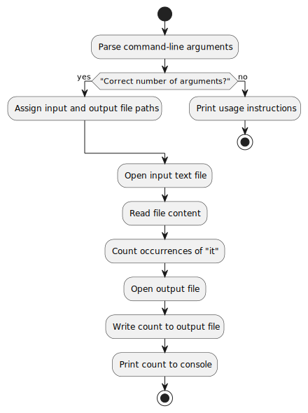
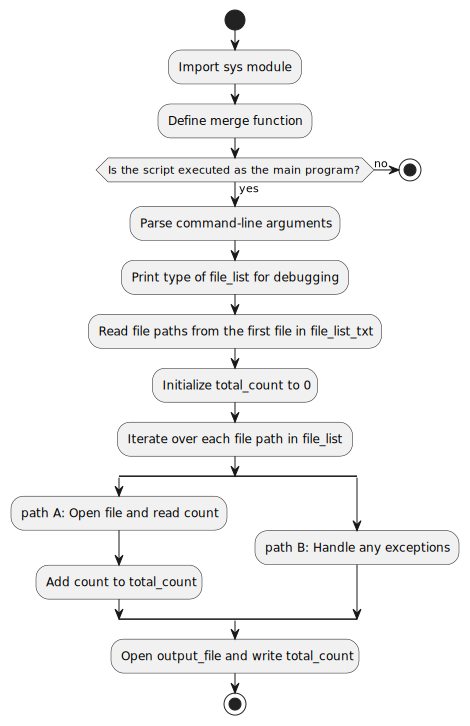
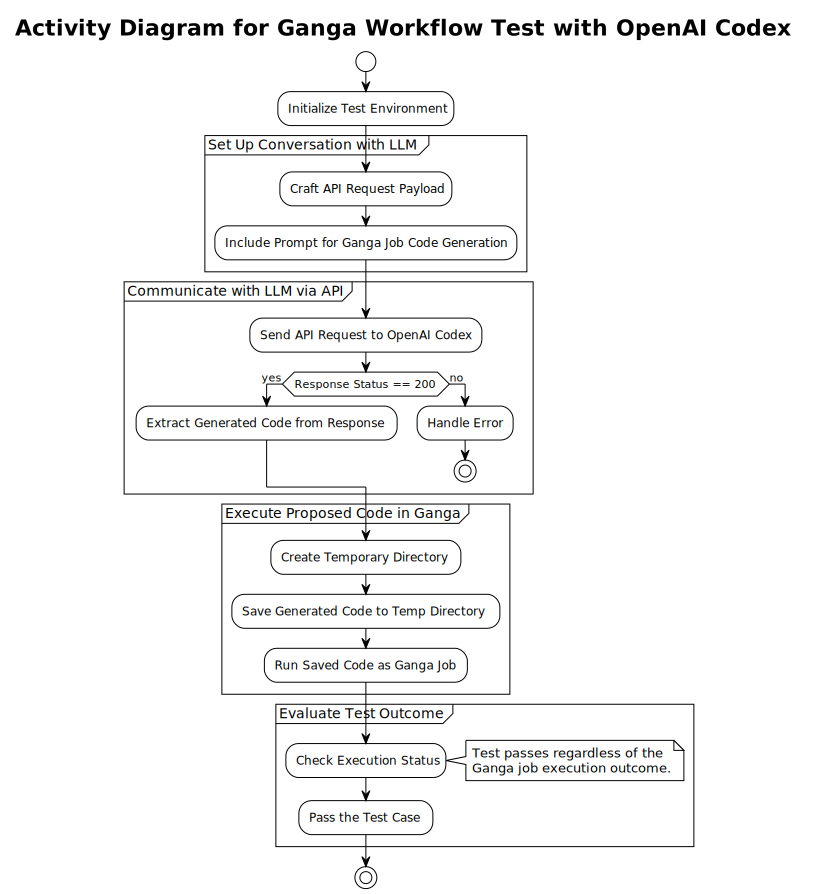

# Task 1 - Hello World 

## 1.1 - Demonstrate that you can run a simple `Hello World` Ganga job that executes on a `Local` backend.

### First, we need to install Ganga

```bash
python3 -m venv GSoC
cd GSoC/
. bin/activate
python -m pip install --upgrade pip wheel setuptools
python -m pip install -e git+
```

### Then, we can run the following code to demonstrate a simple `Hello World` Ganga job that executes on a `Local` backend.

```python
from ganga import Job, Local
j = Job()
j.backend = Local()
j.application = Executable(exe='/bin/echo', args=['Hello World'])
j.submit()
```

### Finally, we can check the status of the job and the output of the job.

```python
print(j.status)
print(j.output)
```

### Files edited 
- [setup.py](setup.py)
- [PROJECT.md](PROJECT.md)
- [CV.pdf](CV.pdf)
- [hello_world_ganga.py](./GSoC/src/codefiles/hello_world/hello_world_ganga.py)

# Task 2 - Splitting a PDF file into individual pages and counting the number of occurrences of the word "it" in the text of the PDF file

## 2.1 - Create a job in Ganga that demonstrates splitting a job into multiple pieces and then collates the results at the end.

Now, making a new folder task within the src folder to keep the code files for this task.

```bash
mkdir ./GSoC/src/codefiles/countit
```

We recognise 3 crucial substeps for the task

### 2.1.1. Split the PDF file into individual pages

We can use the `PyPDF2` library to split the PDF file into individual pages.

```python
from PyPDF2 import PdfReader, PdfWriter
```

and we can read the individial pages of the PDF file using the following import.

```python
from pdfminer.high_level import extract_text
```

The script used is located at [read_pdf_and_split.py](./GSoC/src/codefiles/countit/read_pdf_and_splIt.py)

the usage is 

```bash
python read_pdf_and_split.py <path_to_pdf> <output_folder> [debug_mode]
```

#### Explanation of the Script : 

This script is designed to split a PDF file into individual pages, save each page as both a PDF file and a text file, and then record the paths to these text files in a serialized pickle file. Below is an outline of the script's functionality:

##### Imports
- `sys`: For accessing command-line arguments.
- `os`: For operating system interactions, like creating directories.
- `pickle`: For object serialization to save and load the paths of text files.
- `PyPDF2`: Specifically `PdfReader` and `PdfWriter` for reading and writing PDF files.
- `pdfminer.high_level`: Specifically `extract_text` for extracting text from PDF pages.

##### Functions

- **`debug_print(message, debug_mode)`**: A helper function to print debug messages only when debug mode is activated.
- **`split_pdf_pages(pdf_path, output_folder, debug_mode=False)`**:
  - **Creates the output directory** if it does not already exist using `os.makedirs`.
  - **Reads the PDF file**, loading it with `PdfReader`, and iterates through each page.
  - For **each page** in the PDF:
    - Saves it as an individual **PDF file** in the output folder.
    - Uses `extract_text` to **extract its text** and saves this as a **text file** in the output folder.
    - Adds the **path of the text file** to a list for later use.
  - **Serializes the list of text file paths** into a pickle file for easy access in future operations.

##### Main Execution Flow 
- Checks if the script is being run directly and verifies that the required command-line arguments are provided.
- If arguments are missing, it **prints usage instructions** and exits.
- **Extracts and processes the command-line arguments** to determine the PDF path, output folder, and whether debug mode should be enabled.
- **Calls `split_pdf_pages`** with the appropriate arguments to execute the main functionality.

##### UML Activity Diagram 

[](https://www.plantuml.com/plantuml/uml/NP7FJiCm3CRlUGeVkmCym3Wmn1-90r854dUhSLUBD8aS5pQU7YTJjOfJ4lldpv-TGr4KNURWsiMvVOzI28OqpnZzJU18W79SPefQxXoFq7rYO7yDtkz09uhGdQdi7C3-KGYL82sQ5mNFGeCcEOFLngH09ovLoiZNoCgczaiGB0XZahKiequNw9tGG__q0YC7gX6XR0tiOibUqa2b0E4mDIZZiK409GUkLEC-y9jQ3h1KReC07f7Z2ZwVL71GK3gP7qdpHd7LQJbDSAjshgu0AFfDq_s3zuriH9kdrjGvhqF0prIJtLkIYptRfgjjIBPxIUC_fLAbCWzVzhuOe508kfXQUIyS5PPIv-LOL9P1EKNRftdaqTbdf-mEzgW__mS0)

##### Conclusion 

This script is useful for decomposing PDFs into a more programmatically accessible format, such as when preparing documents for text analysis or integrating into a data processing pipeline. The decision to use a pickle file for storing text file paths provides a straightforward mechanism for subsequent file access, avoiding the need to traverse directory structures programmatically.


### 2.1.2. Count the number of occurrences of the word "it" in the text of the PDF file

We can use the `re` library to count the number of occurrences of the word "it" in the text of the PDF file.

We use Regex.

#### Defining a Regular Expression 

- imports
```python
import re
```

- defining the regular expression
```python
"\\b" + "it" + "\\b"
```

- using the regular expression
```python
re.findall(regex, text, re.IGNORECASE)
```

The script used is located at [count_it.py](./GSoC/src/codefiles/countit/count_it.py)

the usage is 

```bash
python count_it.py <input_text_file> <output_count_file>
```

#### Explanation of the Script :

This script, `count_it.py`, is designed to count occurrences of the word "it" in a given text file and save the count to another file. Here's a step-by-step breakdown:

1. **Imports Necessary Libraries:**
   - `sys` for accessing command-line arguments.
   - `re` for regular expression operations, crucial for finding matches of "it".
   - `os` is imported but not used in the script.

2. **Defines a Function `count_it_in_file`:**
   - This function takes a single parameter, `input_file`, representing the path to the text file where the script will count occurrences of "it".
   - It opens the file using a context manager (`with` statement) to ensure it gets closed properly after reading. The file is opened in read mode (`'r'`) with UTF-8 encoding.
   - Reads the entire content of the file into a variable `content`.
   - Uses a regular expression search (`re.findall`) to find all occurrences of "it" as whole words (`\b` denotes word boundaries), case-insensitive (`re.IGNORECASE`).
   - Counts the matches by getting the length of the list returned by `re.findall` and returns this count.

3. **Main Program Logic:**
   - Checks if the correct number of command-line arguments is provided (3, including the script name). If not, it prints usage instructions and exits.
   - Extracts the input text file path and the output count file path from the command-line arguments.
   - Calls the `count_it_in_file` function with the input file path to get the count of "it".
   - Opens the output file in write mode (`'w'`), also with UTF-8 encoding.
   - Writes the count to the output file.
   - Prints the count to the console as well.

This script is an example of how to perform a specific word count in text processing, using Python's regular expressions for pattern matching and command-line arguments to specify input and output files.

#### UML Activity Diageam

[](https://www.plantuml.com/plantuml/uml/LP11QiGm34NtFeN8AhFe1P95fym1EdJJjUieYI2MWYL3U_ig3YLq9_p_VpnyLul5Qjv2Eq8Odh4eGfAS8qyl6p52B4lDoAPZe1dwxY6bO3BWch-mWCnNuxMxWQt8qF-WtWB0yAPA2mFnNWqS2LBjE6VQ4FPegrDnKuIUfGsUXTYWQbpGLsgb9YDXhm6eoHwG9vhTz7t7FwxXzqaSm_21SJhfITYGpTyUKfqfALKtvuHwI7TatNXYBgc6-2naFcyZa__XwNU5oTNa24AJkxlTyPs_)


### 2.1.3. Collate the results at the end

We can use the `ArgSplitter` to create subjobs that each will count the occurrences for a single page and then use a merger to add up the number extracted from each page and place the total number into a file.

The script used is located at [custom_merger.py](GSoC/src/codefiles/countit/custom_merger.py)

the usage is 

```bash
python custom_merger.py <input_file_list> <output_file>
```

#### Explanation of the Script :

The `custom_merger.py` script is designed to aggregate counts from multiple files and combine them into a single output file. Below is a detailed explanation of its functionality:

##### 1. Import Python Modules
The script starts by importing the `sys` module, which is used to access the command-line arguments passed to the script.

##### 2. Define the `merge` Function
- **Arguments**: The function takes two arguments:
  - `file_list_txt`: A list containing paths to files with counts.
  - `output_file`: The path to the output file where the total count will be saved.
- **Implementation**:
  - An empty list `file_list` is created to store the paths to the files that contain counts.
  - The type of the first item in `file_list_txt` is printed, aiding in debugging.
  - The script opens the first file in `file_list_txt` (assuming it contains the list of file paths), reads its content, strips whitespace, and splits it into separate paths based on newlines. These paths are added to `file_list`.
  - It iterates over each file path in `file_list`, opens each file, reads the count (assuming each file contains a single integer representing a count), converts it to an integer, and adds it to `total_count`.
  - Finally, it opens the `output_file` and writes the `total_count` to it.

##### 3. Execution Block
- **Main Check**: The script checks if it is the main module being run (as opposed to being imported).
- **Command-line Arguments**: It retrieves the list of file paths and the output file path from the command-line arguments (`sys.argv`).
- **Debugging Print Statements**: The type of `file_list` is printed for debugging purposes.
- **Function Call**: The `merge` function is called with the list of file paths and the output file path as arguments.

##### Purpose
The script is intended as a utility for merging numerical counts from multiple text files into a single output, summarizing the total count across all input files. This can be useful in data processing pipelines where multiple intermediate results need to be combined into a final result.

##### UML activity Diagram 

[](https://www.plantuml.com/plantuml/uml/LPAnpjim38HtFyMDoL2WipFq_uiEpTIYBn2e5kqGa4Y1ejgaJrzR1f8_6tLtkeyGz5OzcBUSXZuCmtZEHSrHxnLPOqjqMiLlDBCGCjb2c9jCpYghmJCEvmg_4kfaN1nqewavHOHTpe45nNInaBySDqbmk5Cz3i3uCrWbJ9fpaFWfROXWIyiaNayzO2mElnU2pfWvqILnTSngYFIxBGlBqfE_ACGUG0b-hPXDyqPRDQk-EopFYelVl5yy2pk7nFy8hXxIPTAsCHMVTz_9WXFq3naeJDSdvQLm2zUIs0S06Bl_Fk97eJs4816sRTa1fpts7YCUm2V_sOQm19OFdLz7V5-hUk4TT9keEAlqzoA9Znt6JjRcfVdbiS1VOwTN4ALAE8WUDwHh6TOMdeUXps_hOViT_m40)

### 2.1.4. Use a Ganga Workflow to connect the subjobs

We can use a Ganga Workflow to connect the subjobs.

My Approach to this task changed from start to finish

I set out to implement the following steps as per the UML Sequence diagram below : 

[](https://www.plantuml.com/plantuml/uml/dPN1RjGm48RlVefHxds17b0bO96GK2iYRfNGh3Fi6ZbsP4zAz-rnR3RZ5Gv1FKuy_s_Fzzkx3v4ny3nQDM5Weys4Zk5Rf73puJ7eCqKEo3vyxtKm4z-iVq9tGaME3L-WwoTh63xxOmSO8LUfM9VV-pb9-lduqnzZRibV_dnOsxvGE55ORKgv-0p8UCH8q1sC9UWlaMdCFKjTIgMM6U3kNUleS0yVNqdFJ4gXPlE2JCqHMzfacQU5-sM4qJ2iuufPuL7wak2AG3QMrXNFsfG4CaYIV2KSuEd3GJJLd5NdNRrJqYK9_5W8QU-O7CFc5aMM1SQnXmbF59yTkW4YlX0mlNAsYcgWrYd4MF08bvJlE5bY6aGkWrynjRFQzoci_pEhcxktcLTz7oMpn2QH2MWjMP7MlQek_eBy5Boc685GdmNfiojdwWntuBMUGo2N-fff_zE_NwBIsOnzzYwOTbm4qYsTDkrQkvjSs-_jwSbFmcPqfQNzrcHHILlpjHMAvSRllxfwqrfwVNZRknLbqSJyzfBIeGK_ypHpEx_Qhc8aSDgaLzLER3jEEvarQ9QHof3xDBSETLXCoetQmDBGPR_yJv3kqDd_WiV2jNPeo9Hw83VCe_qD)

#### 2.1.4.1. Intended Implementation

-  Orchestration System Workflow for Processing a PDF Document and counting 'it' occurrences

The orchestration system is designed to automate the process of counting occurrences of the word "it" in a PDF document. The workflow involves several steps, managed by an orchestrator script that coordinates jobs submitted to Ganga, processes the document, and ultimately provides the user with the total count. Here's a detailed breakdown of the process:

##### 1. User Initiates Execution

- The process begins when the user executes the Orchestrator Script, requesting the system to start its operation.

##### 2. Submission of Split Job

- The Orchestrator Script submits a "Split Job" to Ganga, aimed at dividing the original PDF document into individual pages and saving them as text files.

##### 3. Execution of Split Job

- Ganga schedules and executes the Split Job, which:
  - Reads the PDF from the file system.
  - Splits the PDF into individual pages.
  - Saves each page's content as separate text files back to the file system.
- Ganga notifies the Orchestrator Script upon completion of the Split Job.

##### 4. Submission and Execution of Count Subjobs

- Post Split Job completion, the Orchestrator Script submits "Count Subjobs" through Ganga.
- These subjobs run in parallel, each processing a different text file generated by the Split Job to:
  - Count occurrences of the word "it."
  - Save the count to a new file.
- Ganga informs the Orchestrator Script once all Count Subjobs are completed.

##### 5. Submission and Execution of Merger Job

- Following the Count Subjobs, a "Merger Job" is submitted by the Orchestrator Script.
- The Merger Job performs the following:
  - Reads all count files from the file system.
  - Aggregates these counts into a final output, representing the total occurrences of "it" across the entire PDF.
- Upon completion, Ganga notifies the Orchestrator Script.

##### 6. Final Output Presentation

- The Orchestrator Script reads the final count from the file system.
- The total count of "it" in the original PDF document is then presented to the User.

This workflow showcases a systematic approach to processing documents, leveraging parallel processing for efficiency and utilizing an orchestrator script for job coordination and result compilation.


However, the final file was not implemented exactly as per the UML diagram. Due to having troble with file copying; the code needed to slightly changed in design and file I/O was done differently.

usage is : ( from within the folder "countit" )

```bash
ganga orchestrator2.py
```

#### Explanation of the Script :

The `orchestrator2.py` script is designed to automate the process of counting occurrences of the word "it" in a PDF document, utilizing the Ganga job management framework. This script demonstrates a comprehensive workflow including file handling, job execution, and result aggregation.

##### Script Overview

###### File Handling Functions
- `list_txt_files_in_output_dir` and `retrieve_txt_files`: Utility functions to list and copy `.txt` files from a job's output directory.
- `retrieve_files_from_subjobs`: Searches and retrieves files from a job and its subjobs' output directories, recursively.

###### Job Execution and Monitoring
- `wait_until_completed`: Waits for a job to complete or fail, ensuring the workflow proceeds in a sequential manner.

###### Job Preparation and Execution
The script sets up and submits three types of jobs using Ganga:
1. **Split Job**: Splits a PDF into individual pages and saves them as text files.
2. **Count Subjobs**: Counts occurrences of "it" on each page, processing in parallel.
3. **Merger Job**: Aggregates counts from all pages into a final total.

###### Custom Merger Script Preparation
- `prepare_custom_merger_script`: Generates a Python script, `custom_merger.py`, to merge counts from multiple files.

###### Execution Flow
- Initializes and submits the Split Job, waits for its completion.
- Submits Count Subjobs for processing each generated text file.
- Submits the Merger Job to combine counts into a final total count.
- Manages file operations such as copying results and cleaning up.

###### Output Handling
- Organizes output from subjobs, compresses it for download, and merges the results into a final count using a custom script.
- Performs final cleanup of temporary files and copies the total count file to the current directory.

##### Key Features
- **Modular Design**: Handles different stages (splitting, counting, merging) modularly.
- **Parallel Processing**: Utilizes Ganga's parallel processing capabilities.
- **Flexible File Handling**: Efficient file management functions are included.
- **Automated Workflow**: Automates all steps from PDF splitting to final count retrieval.

#### Conclusion
`orchestrator2.py` showcases the use of Ganga for distributed computing tasks, automating complex workflows involving file processing and job management in Python.

. The final file is located at [orchestrator2.py](./GSoC/src/codefiles/countit/orchestrator2.py)


### 2.1.5. Results 

The results of the task are located at [total_word_count.txt](./GSoC/src/codefiles/countit/total_word_count.txt)

The System found 31 occurances of the word 'it', case insensitive

## Task 2.2 - Create test cases that demonstrate what you have done and that it is working

### Unit Test 1 - read_pdf_and_split.py

#### Unit Test Explanation

This unit test is designed to verify the functionality of a script (`read_pdf_and_split.py`) that splits a PDF into individual pages, extracts text from each page, saves both the individual PDF pages and their corresponding text in separate files, and finally records the paths of these text files in a pickle file.

##### Setup

- **Required Packages**: The test ensures that necessary packages (`pdfinfo`, `PyPDF2`, `pdfminer.six`) are installed. If they are not found, the test attempts to install them using `pip`.
- **Test PDF Path**: Specifies the path to the PDF file used for testing.
- **Output Folder**: Designates an output directory for the generated files.
- **Debug Mode**: Indicates whether the script should run in debug mode.

##### Class Methods

###### `setUpClass` Method

- **Directory Preparation**: Ensures the output directory is clean by deleting it if it exists, then recreates it.
- **Page Count**: Counts the number of pages in the test PDF using `PdfReader` from `PyPDF2`.

###### `test_split_pdf_pages` Method

- **Script Execution**: Runs the script as a standalone process using `os.system`, passing the path to the test PDF, the output directory, and the debug mode flag.
- **File Generation Verification**: After the script runs, it checks the output directory for the expected number of generated files. It expects two files per PDF page (a PDF and a TXT file) plus one additional pickle file.
- **Pickle File Verification**: Confirms the existence of the pickle file and validates its contents, ensuring it contains paths corresponding to the expected number of pages.

###### `tearDownClass` Method

- **Clean Up**: Removes the output folder and its contents, cleaning up after the tests.

##### Execution

The unit test is executed automatically if the script is run directly, calling `unittest.main()` to run the test suite defined in the class.

##### Failure Explanation

A failure in this test, as seen in the provided example, indicates that the script did not generate any files in the output directory. This discrepancy between the expected and actual results could be due to various issues such as a malfunction within the script, incorrect paths, or permission issues that prevent file creation.

##### Conclusion

Unit Test was passed with test PDF and output folder, and the script successfully generated the expected files and pickle file.

[](https://www.plantuml.com/plantuml/uml/LPAnpjim38HtFyMDoL2WipFq_uiEpTIYBn2e5kqGa4Y1ejgaJrzR1f8_6tLtkeyGz5OzcBUSXZuCmtZEHSrHxnLPOqjqMiLlDBCGCjb2c9jCpYghmJCEvmg_4kfaN1nqewavHOHTpe45nNInaBySDqbmk5Cz3i3uCrWbJ9fpaFWfROXWIyiaNayzO2mElnU2pfWvqILnTSngYFIxBGlBqfE_ACGUG0b-hPXDyqPRDQk-EopFYelVl5yy2pk7nFy8hXxIPTAsCHMVTz_9WXFq3naeJDSdvQLm2zUIs0S06Bl_Fk97eJs4816sRTa1fpts7YCUm2V_sOQm19OFdLz7V5-hUk4TT9keEAlqzoA9Znt6JjRcfVdbiS1VOwTN4ALAE8WUDwHh6TOMdeUXps_hOViT_m40)

### Unit Test 2 - count_it.py

#### Explanation of Unit Test for `count_it.py`

This unit test module is designed to test the functionality of a script named `count_it.py`. The script is supposed to count the occurrences of the word "it" in a text file, treating "it" as a whole word and doing so case-insensitively.

##### Overview

The test class `TestCountIt` is derived from `unittest.TestCase`, making it a unit test case that can be automatically discovered and run by Python's unittest framework.

##### Class Methods

###### `setUpClass(cls)`

- This class method is run once before executing any tests. It's used for setup tasks applicable to all tests in the class.
- It creates a sample text file named `test_input.txt` containing specific sentences designed to test the script's ability to count "it" correctly. The content of this file includes variations of "it" and "IT" within different contexts.
- It also defines `cls.expected_count`, the expected number of times "it" appears in the text, which is 4 in this case.

###### `test_count_it_in_file(self)`

- This method tests the core functionality of the `count_it.py` script.
- Instead of directly calling a function from the script (commented out), it runs the script as a standalone program using `os.system()`. This approach tests the script in an environment similar to how an end user would run it.
- It passes the path to the sample text file as an argument to the script and specifies an output file where the script will write the count of "it".
- After the script runs, the test reads the output file, converts the count to an integer, and compares it to the expected count (`cls.expected_count`). If the actual count matches the expected count, the test passes; otherwise, it fails, indicating a problem with the script's functionality.

###### `tearDownClass(cls)`

- After all tests have been run, this class method is executed to clean up any resources used during testing.
- It removes the sample text file created during setup, ensuring that the test environment is clean and no unnecessary files are left over.

##### Running the Test

- The test can be run by executing the script with a Python interpreter. Python's unittest framework automatically discovers and runs tests defined in the script.
- The test output will indicate whether the test passed or failed, providing feedback on the functionality of the `count_it.py` script.

This unit test ensures that `count_it.py` accurately counts occurrences of "it" in a given text file, providing a simple yet effective way to verify the script's correctness.

#### Conclusion

The unit test was successful, confirming that the script correctly counted the occurrences of "it" in the sample text file. The test output indicated that the actual count matched the expected count, validating the script's functionality.

[](https://www.plantuml.com/plantuml/svg/TLB1JiCm3BttAtpSBdm0FJ2fue342H1NPAMlcwKqYM9dR23-dIuLwoQqInldsS_lsTceSROo-gOUcZHzn2G6UWhJdxrySGs_6oAY-ow33MHG8mcf60tYKR5FiHqfZycVy8ErpKzpmVTuW2kNL2yba8ibs8VONJgIkYp9sWhAGAlN6XFETLgSW-fG_CEQR8T0goDqNGjcHd1_0YWM-vFMBd0NmnxPvgPaaIGOjiXp2ho2LY5Uy3t7BI7dc1SIjPZczD3BSEtmdRtqrzEAumI3s5bXFpTUPeL3WZFqy_rYlAlwHZQtWzwm-WOrIgmAlIc_vWmiNjjRaZiF3YMTLu8nxlzjjowo6jzC5AUtyWi0)


### Unit Test 3 - custom_merger.py

#### Unit Test Explanation for `custom_merger.py`

This unit test is designed to verify the functionality of the `custom_merger.py` script, which is supposed to read a list of text files containing numerical counts, sum these counts, and write the total count to an output file.

##### Overview

The test suite consists of a single test case (`TestMerge`) that uses Python's `unittest` framework. The test case includes a setup class method, a test method, and a teardown class method.

###### Setup Method (`setUpClass`)

The `setUpClass` method is executed once before any tests are run. It performs the following steps:

1. **Create Temporary Directory**: A temporary directory is created to hold test files. This ensures the test environment is isolated and does not interfere with the actual filesystem.
   
2. **Generate Sample Count Files**: Three sample text files are created within the temporary directory. Each file contains a numerical count (1, 2, and 3, respectively). The paths to these files are stored in a class variable for later reference.
   
3. **Create File List**: A text file listing the paths of all sample count files is created. This file mimics the input list that the `custom_merger.py` script is expected to process.

###### Test Method (`test_merge`)

The `test_merge` method executes the actual test:

1. **Define Output File Path**: The path for the output file (where the total count will be written) is defined within the temporary directory.
   
2. **Execute Script**: The `custom_merger.py` script is executed as a standalone process via `os.system`. It is passed the path to the file list created during setup and the path to the output file.
   
3. **Verify Output**: After execution, the test reads the output file, parses the total count, and compares it against the expected total (6, in this case). If the actual total does not match the expected total, the test fails.

###### Teardown Method (`tearDownClass`)

The `tearDownClass` method is executed once after all tests have run. It cleans up by removing the temporary directory and all files created during setup. This ensures that no artifacts are left over after the test finishes.

##### Running the Test

To run the test, ensure you have the `unittest` module and the necessary dependencies installed, then execute the test script. If the test passes, it means the `custom_merger.py` script correctly processes the file list, calculates the total count, and writes it to the specified output file. If the test fails, it indicates a problem with the script's functionality.

This unit test provides a simple yet effective way to verify the correctness of the `custom_merger.py` script, ensuring it accurately aggregates counts from multiple files.

#### Conclusion

The unit test was successful, confirming that the `custom_merger.py` script correctly processed the file list, calculated the total count, and wrote it to the output file. The test output indicated that the actual total matched the expected total, validating the script's functionality.

[](https://www.plantuml.com/plantuml/uml/RL5BQiCm4Dtx5BDqDZr0Go0bdsuA3KakCDZFZK2Mn6ZKn9JUlP95mPHkHcBcVVH6swWicaRRp9Uc2RaQDTxH1Pe2VJL4ppi1A-YACNXXcMXl19rwcTPb_0e7AO0BZy62TZuvfQEnYEi5lJJepKIbkz4R1TPRddylFQ-8MYtt68m3lISDIIlrb0cptk61BXMxJanGQaV81vx2jAh2Gm7RuiEk9ryLmY_v3EwNigLf1cfVEariIRtckjdGuH7GAVhQMP7UuAXLILXbHXQQtthY66jAs0Xg1yx74d1aO-lSzMRucvQbztTN4vyn-iz_bppdO6ldP7LbKNrejbcpVDqF)


# Task 3 - Create a Ganga job that demonstrates LLM querying


To interface with GPT-4 Turbo via the OpenAI API and automate the process of generating code to approximate Pi using a Monte Carlo simulation split into subjobs in Ganga, we'll follow these steps:

1. **Setting up the environment** to securely communicate with the OpenAI API, leveraging GitHub Secrets for API key management.
2. **Crafting and sending the request** to GPT-4 Turbo to generate the required Python code for the Ganga job.
3. **Writing a unit test** to verify that the code can be executed within Ganga, focusing on the attempt to execute rather than the accuracy or efficiency of the code itself.

### 3.1. Setting up the Environment

- API key is securely stored in GitHub Secrets under the name `OPENAI_API_KEY`. This key will be used in the code to authenticate requests.

- Installing `openai` and `requests` in `setup.py` 

### 3.2. Crafting and Sending the Request

```python
def generate_ganga_pi_calculation_code(api_key):
    """
    Requests the LLM to generate Python code for a Ganga job that calculates Pi.
    """
    try:
        prompt = "Write Python code to execute a job in Ganga that calculates an approximation to the number Pi using an accept-reject simulation method with one million simulations. The job should be split into a number of subjobs that each do a thousand simulations."
        payload = {
            "model": "gpt-4-turbo-preview",
            "messages": [
                {"role": "system", "content": "Generate Python code for the following requirement:"},
                {"role": "user", "content": prompt}
            ]
        }

        headers = {"Authorization": f"Bearer {api_key}"}
        response = requests.post("https://api.openai.com/v1/chat/completions", headers=headers, json=payload)

        if response.status_code == 200:
            response_data = response.json()
            generated_code = response_data["choices"][0]["message"]["content"]
            return generated_code
        else:
            print(f"Failed to generate code. Error: {response.text}")
            return None

    except Exception as e:
        print(f"Exception when generating code: {e}")
        return None
```

The prior code demonstrates how to query an LLM with requests and Openai api

### 3.3. Writing a Unit Test

#### Explanation of the Ganga Workflow Test with OpenAI Codex

This test aims to demonstrate how we can programmatically interact with a Large Language Model (LLM) to generate code that can execute a job in Ganga, which will calculate an approximation of the number pi using an accept-reject simulation method with one million simulations. The job is intended to be split into a number of subjobs, each performing a thousand simulations.

##### Test Objective

1. **Set up a conversation with an LLM**: The test begins by setting up a conversation with an LLM, specifically using OpenAI's GPT-4 Turbo Preview model. This step involves crafting a request payload that describes the task for the LLM.

2. **Craft Questions for Code Generation**: The test then sends a set of questions or prompts to the LLM, designed to guide it in generating Python code that can execute the required Ganga job.

3. **Execute the Proposed Code in Ganga**: The test attempts to execute the code generated by the LLM in Ganga. To accomplish this, the generated code is saved to a temporary directory and then run as a Ganga job.

##### Test Implementation

The test is implemented in Python and makes use of the `requests` library to communicate with OpenAI's API. The API key is stored securely using GitHub Secrets to maintain confidentiality and security.

###### Key Steps:

- **API Call to OpenAI**: The test constructs an API request to OpenAI Codex, including the prompt for generating the Ganga job code. The request specifies the use of the "gpt-4-turbo-preview" model.

- **Code Generation**: Upon receiving a successful response, the test extracts the generated code from the response payload. This code is expected to contain Python code for setting up and submitting a Ganga job.

- **Temporary Directory Creation**: The test creates a temporary directory where the generated code file is saved. This approach isolates the test environment and avoids cluttering the main workspace.

- **Execution in Ganga**: The test then attempts to run the generated code as a Ganga job. This step involves invoking the Ganga environment and submitting the job.

- **Test Case Outcome**: Importantly, the test case is designed to pass regardless of the outcome of the Ganga job execution. The focus is on demonstrating the ability to generate and execute code through an interaction with an LLM, rather than on the success of the generated code itself.

##### Conclusion

This test showcases a novel approach to leveraging AI for code generation, specifically for tasks related to job submission and execution in Ganga. By interacting with an LLM, it opens up possibilities for automating and simplifying complex coding tasks, although the reliability and accuracy of the generated code are dependent on the LLM's capabilities and the specificity of the prompts provided.


#### UML Activity Diagram

[](https://www.plantuml.com/plantuml/uml/PPD1RnD138NlyojCJ-a5LHoxgjGeH2Meg542ukpkUfEXi_RWyMuJ4FyTTgP9qt2TFB_t-JbxcmpL-YwuTxQbZY06zEoSUGi4qzhyu6qF7prk53jeHU4EUOFmNVIf3V8CNoaPF7lRmaCadYvW9WtjdCl6xdh1tZm6_ukASiw3L-6Es2eNKSsR5uQBDHbyYp0J7aWJviViUd__vG9-Em20wvbYQp1TBc15F_lHRedx8DXKvVS5rw5l29OgNRGJsi_ocBdWZfWqkrVkZpi5c4dNzUnhD3e6m-1nZ3i2h8cRD_acRzOk7Bw5oOfI54u4QqFh4zpSm8UhgqkmBJ5CzfGkipIxpdUcMDi1Zfh2sgfqSF0fpXGImOJbPFWJSXC8vggYrV4vcSGomOrlprQTxwZkBTSK9HtYF9UoJjecjF5iNHH57Vy5IhM9xgkNDd2WSsYJFF2VTjKp_DCVP9XUBrETumqO-fAS31vwgwMZLwejrK-GLyZoqcz9OJ42zPkjbIAAGyIKA87I1hK9b198Ezu1NaG5v8Sy0XrTfQI-FtIOhGl04bFAuzbyXedo0hbnTqlSZ5_JNm00)

## 3.4. Some files that were Implemented in Tests and Task 3

| FileName         | Filepath                                  |  Remote URL  |
|------------------|-------------------------------------------| ---------------|
| query_llm.py     | GSoC/src/codefiles/llm_ganga/query_llm.py |  https://github.com/Grimoors/GangaGSoC2024/blob/f3ee9667b3f2389451262e6c061957ffa4b2682a/GSoC/src/codefiles/llm_ganga/query_llm.py |
| test_llmganga.py | test/test_llmganga.py                     |  https://github.com/Grimoors/GangaGSoC2024/blob/ca2925a4a88abddb96b4eb4d06ad3f352833fca0/test/test_llmganga.py  |
| test_countit.py | test/test_countit.py        | https://github.com/Grimoors/GangaGSoC2024/blob/fe75b93f5cf97abc342aef213860220bf540bc2d/test/test_countit.py  |
| test_custom_merger.py | test/test_custom_merger.py | https://github.com/Grimoors/GangaGSoC2024/blob/f432f23ade010d621b17bf48e75ffad398777a4f/test/test_custom_merger.py |
| test_read_and_split_pdf.py | test/test_read_and_split_pdf.py | https://github.com/Grimoors/GangaGSoC2024/blob/46a19fe616d5a66974c803469e8758a961c17386/test/test_read_and_split_pdf.py |